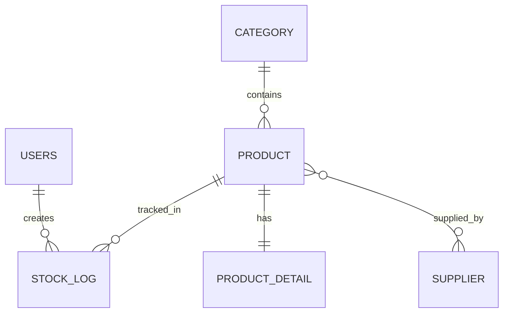

# Inventory Management System (Spring Boot)

An inventory management application with a Spring Boot REST backend and a simple Thymeleaf frontend for quick browser-based usage.

This project is built for the **Software Engineering Lab** requirement and focuses on clean backend architecture plus a beginner-friendly Thymeleaf UI layer.

## Project Overview

- **Domain**: Inventory management
- **Backend**: Spring Boot 3.2.5, Java 21, Spring Data JPA, Spring Security, Validation
- **Database**: PostgreSQL
- **API Style**: REST + DTO-based responses
- **Frontend**: Thymeleaf templates with a minimal multi-page UI
- **Testing**: JUnit 5, Mockito, Spring Boot Test, MockMvc
- **Containerization**: PostgreSQL via Docker Compose
- **CI**: GitHub Actions (`.github/workflows/ci.yml`) runs Maven tests on pushes and PRs
- **CD**: GitHub Actions (`.github/workflows/cd.yml`) triggers Render deploy on `main`

## Requirement Coverage (Current Status)

Status legend: `Done`, `Partial`, `Pending`

| Requirement | Status | Notes |
|---|---|---|
| Authentication and Authorization | Partial | Registration, BCrypt encryption, role field, URL-based rules in `SecurityConfig`; login/logout UI flow not yet documented/implemented with custom endpoints. |
| REST API Design (>=3 controllers, CRUD for >=2 entities) | Done | 6 controllers implemented. Full CRUD exists for `Product` and `Category`. |
| PostgreSQL + >=4 tables + relationships | Done | 6 entities with `1:N`, `N:1`, `1:1`, and `N:N` relationships. |
| Testing (>=15 unit + >=3 integration) | Done | 22 service-layer unit tests and 12 controller MockMvc tests passing locally/CI. |
| Dockerization (`Dockerfile` + compose app+db) | Partial | `compose.yaml` exists for PostgreSQL. Full app+db compose flow can be finalized based on target branch setup. |
| GitHub workflow strategy (`main/develop/feature`, protected main, PR review) | Pending | Process/policy configuration must be set in repository settings. |
| CI/CD (build + test + deploy from main) | Partial | CI test workflow is present; CD workflow for Render deploy hook is added. |
| Deployment on Render + public URL | Partial | Deploy hook workflow exists, but final live URL/setup still required. |
| Documentation (README with architecture, ERD, API, run steps, CI/CD) | Done (this file) | This README documents current implementation and pending items. |

## Architecture

Layered architecture is used:

- **Controller layer**: REST endpoints and HTTP status handling
- **Service layer**: business rules and validations
- **Repository layer**: Spring Data JPA data access
- **Entity/DTO layer**: persistence models + API-safe response models
- **Exception layer**: centralized global exception handling

### Package Structure

```text
src/main/java/com/example/inventorymanagement
|- config/
|  |- SecurityConfig.java
|- controller/
|  |- CategoryController.java
| |  |- PageController.java
|  |- ProductController.java
|  |- ProductDetailController.java
|  |- StockLogController.java
|  |- SupplierController.java
|  |- UserController.java
|- dto/
|- entity/
|- exception/
|- repository/
`- service/
```

## Data Model (ER Overview)



Entities implemented:

- `Users`
- `Category`
- `Product`
- `ProductDetail`
- `Supplier`
- `StockLog`

## Security and Role Access

`SecurityConfig` uses URL-based authorization, HTTP Basic (for API tools like Postman), and form login/logout for the browser UI.

- Public:
  - `GET /login`
  - `GET /`
  - `POST /api/users/register`
  - `/api/products/**`
  - `/ui/register`
- Authenticated UI:
  - `/ui/**` (after login)
- Admin only:
  - `/api/users/**`
- Admin or Seller:
  - `/api/categories/**`
  - `/api/suppliers/**`
  - `/api/product-details/**`
  - `/api/logs/**`

Password encryption is handled using `BCryptPasswordEncoder` in `UserService.registerUser`.

## Thymeleaf Frontend (Simple UI)

The project includes a basic server-rendered UI using Thymeleaf and `@Controller` endpoints.

### Page Controller

- `PageController` serves UI routes under `/ui`
- It fetches data through existing services, so REST APIs are not modified

### UI Routes

- `GET /login` - login page for `ADMIN` / `SELLER` / `BUYER`
- `GET /ui/dashboard` - summary counts (products/categories/suppliers)
- `GET /ui/products` - product list
- `GET /ui/categories` - category list
- `GET /ui/suppliers` - supplier list
- `GET /ui/register` - user registration form
- `POST /ui/register` - submit registration form
- `POST /logout` - logout current user and redirect to login page

### Template Files

- `src/main/resources/templates/dashboard.html`
- `src/main/resources/templates/products.html`
- `src/main/resources/templates/categories.html`
- `src/main/resources/templates/suppliers.html`
- `src/main/resources/templates/register.html`
- `src/main/resources/templates/fragments/navbar.html` (shared navbar fragment)

## REST API Endpoints

### Users

- `POST /api/users/register` - register user
- `GET /api/users/{username}` - get user by username

### Categories

- `GET /api/categories` - list categories
- `POST /api/categories` - create category
- `GET /api/categories/{id}` - get category by id
- `PUT /api/categories/{id}` - update category
- `DELETE /api/categories/{id}` - delete category

### Products

- `GET /api/products` - list products
- `POST /api/products?categoryId={id}` - create product
- `PUT /api/products/{id}/stock?newQuantity={n}&username={user}` - update stock and write stock log
- `DELETE /api/products/{id}` - delete product

### Product Details

- `GET /api/product-details/{id}` - get details by id
- `POST /api/product-details` - create details

### Suppliers

- `GET /api/suppliers` - list suppliers
- `POST /api/suppliers` - create supplier

### Stock Logs

- `GET /api/logs` - list stock transaction logs

## Exception Handling

`GlobalExceptionHandler` maps exceptions into consistent JSON error payloads:

- `ResourceNotFoundException` -> 404
- `IllegalArgumentException` -> 400
- Generic `Exception` -> 500

## Testing

Test stack:

- JUnit 5
- Mockito
- `@WebMvcTest` + MockMvc for controller integration-style tests
- Service-layer unit tests with mocked repositories/dependencies

Current suite:

- **Unit tests (service layer)**: 28
- **Controller tests (MockMvc)**: 18
- **Total**: 46 tests

Run tests locally:

```bash
./mvnw clean test
```

For Windows PowerShell:

```powershell
.\mvnw.cmd clean test
```

## Local Setup

### Prerequisites

- Java 21
- Maven (or use Maven Wrapper)
- Docker + Docker Compose
- PostgreSQL (or containerized Postgres from compose)

### Environment Variables

Create/update `.env`:

```dotenv
DB_USER=admin
DB_PASSWORD=adminpassword123
ADMIN_USERNAME=admin
ADMIN_PASSWORD=change-this-in-production
```

`ADMIN_PASSWORD` is required in production (for example, in Render environment variables).
On first startup, the app auto-creates an ADMIN user if no ADMIN exists yet.

### Start PostgreSQL with Docker Compose

```bash
docker compose up -d
```

### Run the application

```bash
./mvnw spring-boot:run
```

PowerShell:

```powershell
.\mvnw.cmd spring-boot:run
```

The app reads DB settings from `src/main/resources/application.yaml`.

Open the simple UI in your browser after starting the app:

```text
http://localhost:8081/
```

## CI Pipeline

GitHub Actions workflow: `.github/workflows/ci.yml`

What it does:

1. Triggers on push and pull request
2. Starts PostgreSQL service container
3. Sets `DB_USER` and `DB_PASSWORD` env vars for tests
4. Sets up JDK 21
5. Runs `./mvnw -B clean test`

## CD Pipeline (Render)

GitHub Actions workflow: `.github/workflows/cd.yml`

What it does:

1. Triggers on push to `main`
2. Reads deploy hook from GitHub Secret `RENDER_DEPLOY_HOOK_URL`
3. Sends a `POST` request to trigger Render deploy

If `RENDER_DEPLOY_HOOK_URL` is not configured, the workflow fails with a clear message.

## Dockerization Status

Implemented:

- `compose.yaml` for PostgreSQL service
- Environment variable based DB credentials
- CD deploy workflow (`.github/workflows/cd.yml`)

Pending for full requirement compliance:

- Add `Dockerfile` for Spring Boot app
- Extend compose to include both `app` and `postgres` services
- Validate full run with:

```bash
docker compose up --build
```

## Render Deployment Status

Live:

- Public URL: https://inventory-management-tbvp.onrender.com

## Git Workflow (Recommended for Requirement)

- Long-lived branches: `main`, `develop`
- Short-lived branches: `feature/*`
- Open PR from feature -> develop, then develop -> main
- Protect `main` and require at least one approval

## Known Gaps to Close Before Final Submission

1. Add app `Dockerfile` and full compose app+db setup (if missing in target branch).
2. Configure `RENDER_DEPLOY_HOOK_URL` in repository secrets.
3. Enforce branch protection and PR review policy in GitHub settings.
4. Add/verify login/logout flow documentation and screenshots for demo.
5. Add architecture and ER diagrams as image files in `docs/` if your instructor prefers images over Mermaid.

## Demo Checklist (5-minute presentation)

- Project architecture and entity relationships
- Security roles and restricted endpoints
- API demo (register, create product, update stock, view logs)
- Test execution in CI
- Docker and deployment status

---
